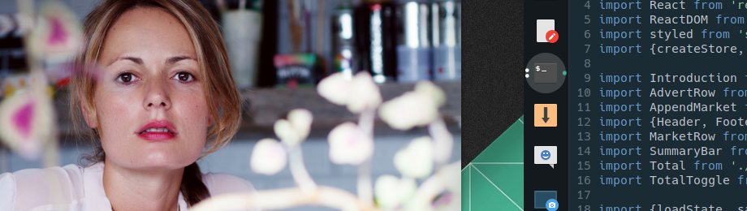
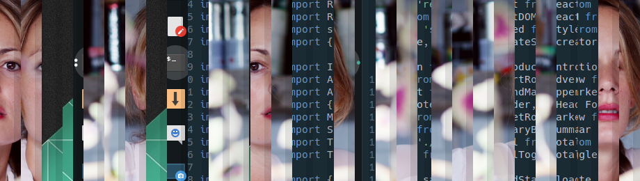
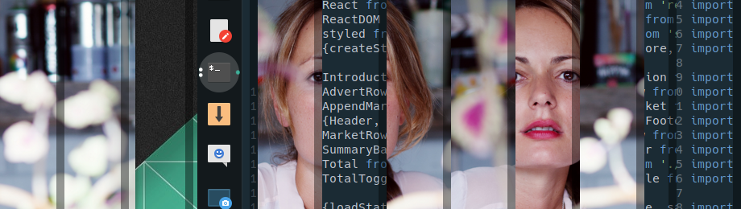
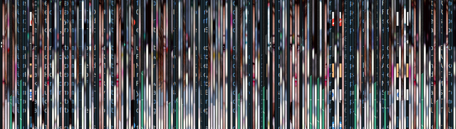

# shredder

_Eats perfectly fine images and spits them out as spaghetti. Shredded beyond recognition._

**BEWARE!!! coz it turns images from this ...**


**into this ... not a very nice thing to do, really!**

(FIG1. default settings)

**... ah! look! it's been at it again ...**

(FIG2.  -o images/920x260_rgb_example_02.png -w 40 -b 80 -t 0.6)

**... sorry ... it was born this way**

(FIG3.  -o images/920x260_rgb_example_03.png -w 5 -b 1 -t 0)

## Usage:

    ./shredder.py -i <input-image> [options]


## Options

| argument       | type        | def  | comment                                 |
| -------------- | ----------- | ---- | --------------------------------------- |
| -i, --input=*  | filename    |      | image file name (PNG recommended)       |
| -o, --output=* | filename    |      | input file name plus "_shredded" suffix |
| -w, --width=*  | int (px)    | 20   | width of the slices                     |
| -b, --border=* | int (px)    | 1    | width of the edge border                |
| -t, --tint=*   | float (0-1) | 0.9  | 0 = black, 1 = transparent              |

## Dependancies

- Python3
- OpenCV v3
- Numpy


## Usefull application ... Anyone?

There is none. This is a silly useless script to waste my  ... oh hang on.

- Do you use i3 window manager?
- Do you use i3lock to prevent people from fiddling?
- Do you know what `scrot` or `maim` is used for?
- Do you need a new rice?

If you answered those question with a majority YES, then you know what this script is good for.


## Use with the i3lock (on Manjaro i3)

First install all the python dependencies as global modules `sudo pip3 install numpy opencv-python` then copy `shredder.py` to the `/usr/bin/`directory, using sudo so that the script has execute permission.

Finally open `/usr/bin/blurlock` and make it look like this ... (I have kept the original code in comments) 


```bash
#!/bin/bash
# /usr/bin/blurlock

# take screenshot
import -window root /tmp/screenshot.png

# blur it
# convert /tmp/screenshot.png -blur 0x5 /tmp/screenshotblur.png
# rm /tmp/screenshot.png

# shredder it ... :D - output: screenshot_shredded.png 
python shredder.py -i /tmp/screenshot.png -w 20 -b 2 -t 0.85
rm /tmp/screenshot.png

# lock the screen
# i3lock -i /tmp/screenshotblur.png
i3lock -i /tmp/screenshot_shredded.png

# sleep 1 adds a small delay to prevent possible race conditions with suspend
sleep 1

exit 0
```


## ... and what is the _"shredder.sh"_ file ... ?

Ah! yes, you caught me. The bash script was the original solution. 

It uses ImageMagick to cut up an image into pieces, these are saved in a working folder, with a random numeric filename. 
When the slicing is done, we use IM again, to stitch all the images back together. The random filenames result in the file system ordering then, and in affect it shuffles the original sequence. Cute idea right? Unfortunately it is VERY slow, well compared to vector maths with openCV and numpy ... it's slow.


So I abandoned that approach in favour of python. Have a look at the jupyter notebook, that was also fun to work with. I wish web dev had something as easy as that.

The disadvantage of the python is the dependencies. It was a bitch to get openCV installed. But that being done, it is a dream to work with. Anyway that is the story.


Looking at the number of lines, bash is the winner. Use which ever you like.

## ... and lastly ... who is the girl?

[Ivana Miño](http://ivanamino.com/) a Spanish actress and an old friend, I helped her create a new website. Say hello.

